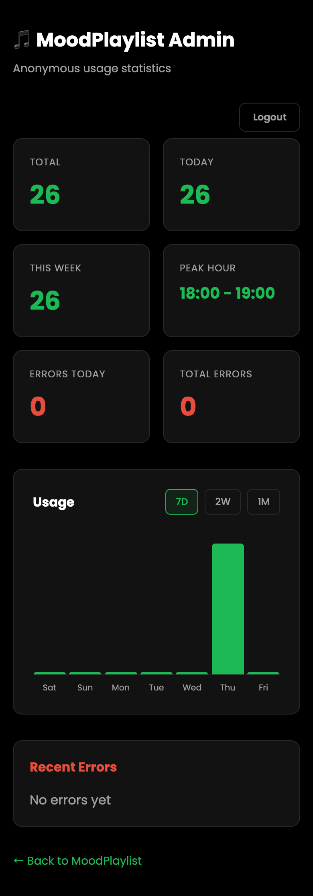

# MoodPlaylist


**Describe your mood. Get a real playlist.**

MoodPlaylist transforms your feelings into curated playlists. Type how you're feeling -- whether it's "post-breakup melancholy," "Sunday morning coffee vibes," or "need energy for a workout" -- and get a playlist of 8-10 real songs with album art and YouTube links.

Powered by Groq API (Llama 3.3 70B). [Live on Vercel](https://moodplaylist.vercel.app).

---

## Features

### Core
- **Mood-to-Playlist AI** -- Describe any feeling, emotion, or scenario and get a tailored playlist
- **Real Songs Only** -- No generic recommendations; actual tracks by real artists
- **Album Art** -- Fetches real artwork from iTunes for each track
- **YouTube Integration** -- Each track includes a direct link to YouTube
- **Creative Playlist Titles** -- AI generates catchy, thematic names for every playlist
- **Cover Art Descriptions** -- Vivid descriptions of what the playlist artwork would look like

### History & Admin
- **Playlist History** -- Saves last 50 playlists to localStorage (no login required)
- **Admin Dashboard** -- View anonymous usage stats at `/admin.html`
- **Usage Charts** -- 7-day, 2-week, 1-month views with daily breakdown
- **Settings Menu** -- Hamburger menu (☰) for quick access to history

### Security & UX
- **Rate Limiting** -- 10 requests per minute per IP
- **Input Validation** -- 500 char limit, HTML tag stripping
- **Prompt Injection Defense** -- Server-side sanitization
- **Auto-retry** -- Retries once on API/parse errors
- **Error Handling** -- Friendly error messages with auto-dismiss

### Design
- **Dark OLED Theme** -- Spotify-inspired design optimized for OLED screens
- **Responsive** -- Works seamlessly on desktop and mobile
- **Accessible** -- ARIA live regions, reduced motion support, semantic HTML
- **SVG Icons** -- Consistent iconography, no emojis

---

## Tech Stack

| Layer | Technology |
|-------|------------|
| **Runtime** | Node.js 18+ |
| **Server** | Express 4.x |
| **AI/LLM** | Groq API (Llama 3.3 70B Versatile) |
| **Database** | Supabase (anonymous stats) |
| **Frontend** | Vanilla HTML, CSS, JavaScript |
| **Fonts** | Google Fonts (Poppins, Righteous) |
| **Design** | Custom CSS design tokens (dark OLED theme) |
| **Hosting** | Vercel (serverless functions) |

---

## Screenshots

| Home | Generated Playlist | Admin Dashboard |
|------|-------------------|-----------------|
|  |  |  |

---

## Getting Started

### Prerequisites

- **Node.js 18+** -- [Download here](https://nodejs.org/)
- **Groq API Key** -- Get a free key at [console.groq.com](https://console.groq.com/)
- **Supabase Account** (optional) -- For admin dashboard stats at [supabase.com](https://supabase.com)

### Installation

```bash
# Clone the repository
git clone https://github.com/shirleyshyun-lgtm/MoodPlaylist.git
cd MoodPlaylist

# Install dependencies
npm install
```

### Environment Setup

```bash
# Copy the example env file
cp .env.example .env
```

Edit `.env` with your credentials:

```env
GROQ_API_KEY=gsk_your_groq_key_here
SUPABASE_URL=https://your_project.supabase.co
SUPABASE_ANON_KEY=your_supabase_anon_key_here
ADMIN_PASSWORD=your_admin_password_here
```

### Database Setup (for Admin Dashboard)

Run this in Supabase SQL Editor:

```sql
-- Stats table
CREATE TABLE playlist_stats (
  id BIGSERIAL PRIMARY KEY,
  created_at TIMESTAMPTZ DEFAULT NOW(),
  status TEXT NOT NULL,
  error_message TEXT
);

-- Admin users table
CREATE TABLE admin_users (
  id BIGSERIAL PRIMARY KEY,
  password TEXT NOT NULL UNIQUE,
  created_at TIMESTAMPTZ DEFAULT NOW()
);

INSERT INTO admin_users (password) VALUES ('your_password_here');

-- Enable RLS
ALTER TABLE playlist_stats ENABLE ROW LEVEL SECURITY;
ALTER TABLE admin_users ENABLE ROW LEVEL SECURITY;

CREATE POLICY "Allow anonymous inserts" ON playlist_stats
  FOR INSERT TO anon WITH CHECK (true);

CREATE POLICY "Allow anonymous reads" ON playlist_stats
  FOR SELECT TO anon USING (true);

CREATE POLICY "Allow anonymous reads" ON admin_users
  FOR SELECT TO anon USING (true);
```

### Running the App

```bash
npm start
```

The app will be available at **http://localhost:3000**.

### Deploy to Vercel

1. Push to GitHub
2. Import the repo on [vercel.com](https://vercel.com)
3. Add environment variables in Settings → Environment Variables
4. Deploy

---

## How It Works

```
User enters mood
       |
       v
Frontend (app.js) sends POST /api/generate
       |
       v
Express server validates input (500 chars, strip HTML)
       |
       v
Server forwards to Groq API
       |
       v
Llama 3.3 70B generates playlist JSON
       |
       v
Server fetches album art from iTunes API
       |
       v
Stats logged to Supabase (anonymous)
       |
       v
Frontend renders playlist with album art + YouTube links
       |
       v
Playlist saved to localStorage (history)
```

---

## API Reference

### Generate Playlist

```
POST /api/generate
```

**Request:**
```json
{ "mood": "feeling nostalgic about summer road trips" }
```

**Response:**
```json
{
  "title": "Windows Down, Stars Out",
  "coverArt": "A warm sunset highway...",
  "tracks": [
    { "song": "Fast Car", "artist": "Tracy Chapman", "albumArt": "https://..." }
  ]
}
```

### Admin Stats

```
POST /api/admin/stats?days=7
```

**Request:**
```json
{ "password": "your_admin_password" }
```

**Response:**
```json
{
  "total": 1247,
  "today": 43,
  "thisWeek": 312,
  "errorsToday": 0,
  "peakHour": "20:00 - 21:00",
  "dailyStats": [{ "date": "2026-06-25", "count": 43 }],
  "recentErrors": []
}
```

---

## Project Structure

```
MoodPlaylist/
├── api/
│   ├── generate.js        # Vercel serverless: playlist generation
│   └── admin-stats.js     # Vercel serverless: admin stats
├── public/
│   ├── index.html         # Main app page
│   ├── app.js             # Frontend logic + history management
│   ├── style.css          # Design system + styles
│   ├── history.html       # Playlist history page
│   └── admin.html         # Admin dashboard
├── server.js              # Express server (local dev)
├── vercel.json            # Vercel deployment config
├── .env.example           # Environment variables template
├── .mcp.json              # MCP server configuration
├── package.json           # Dependencies
└── LICENSE                # MIT License
```

---

## Contributing

Contributions are welcome! Here's how to get started:

1. **Fork** the repository
2. **Create** a feature branch (`git checkout -b feature/amazing-feature`)
3. **Commit** your changes (`git commit -m 'Add amazing feature'`)
4. **Push** to the branch (`git push origin feature/amazing-feature`)
5. **Open** a Pull Request

---

## License

This project is licensed under the MIT License.

---

Built with AI and good taste in music.
