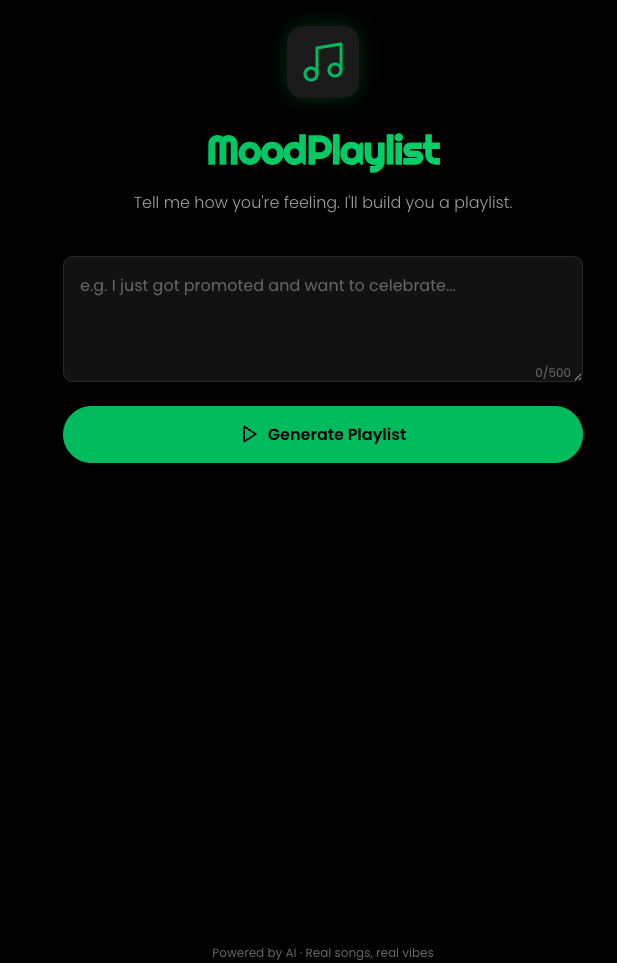
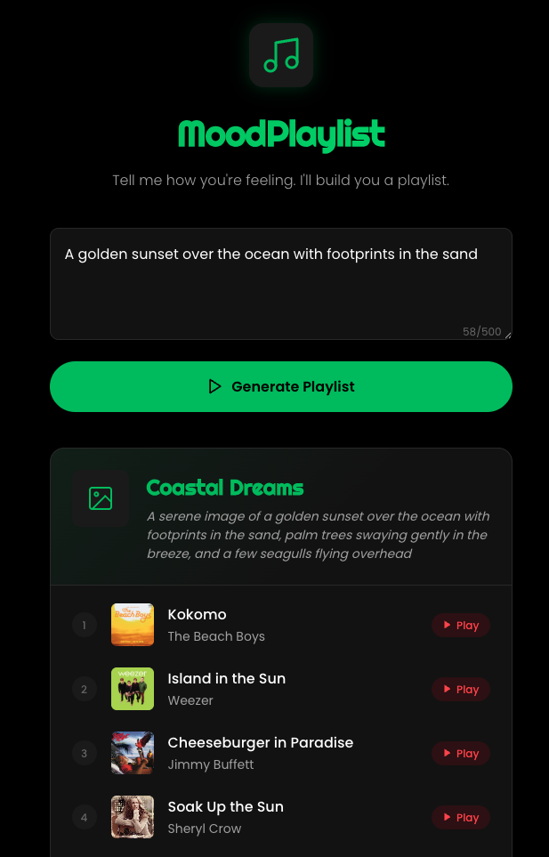

# MoodPlaylist


**Describe your mood. Get a real playlist.**

MoodPlaylist transforms your feelings into curated playlists. Type how you're feeling -- whether it's "post-breakup melancholy," "Sunday morning coffee vibes," or "need energy for a workout" -- and get a playlist of 8-10 real songs with album art and YouTube links.

Powered by Groq API (Llama 3.3 70B). [Live on Vercel](https://moodplaylist.vercel.app).

---

## Features

- **Mood-to-Playlist AI** -- Describe any feeling, emotion, or scenario and get a tailored playlist
- **Real Songs Only** -- No generic recommendations; actual tracks by real artists
- **Album Art** -- Fetches real artwork from iTunes for each track
- **YouTube Integration** -- Each track includes a direct link to YouTube
- **Creative Playlist Titles** -- AI generates catchy, thematic names for every playlist
- **Cover Art Descriptions** -- Vivid descriptions of what the playlist artwork would look like
- **Dark OLED Design** -- Spotify-inspired dark theme optimized for OLED screens
- **Fully Responsive** -- Works seamlessly on desktop and mobile
- **Accessible** -- ARIA live regions, reduced motion support, semantic HTML

---

## Tech Stack

| Layer | Technology |
|-------|------------|
| **Runtime** | Node.js 18+ |
| **Server** | Express 4.x |
| **AI/LLM** | Groq API (Llama 3.3 70B Versatile) |
| **Frontend** | Vanilla HTML, CSS, JavaScript |
| **Fonts** | Google Fonts (Poppins, Righteous) |
| **Design** | Custom CSS design tokens (dark OLED theme) |

---

## Screenshots

| Home | Generated Playlist |
|------|-------------------|
|  |  |

---

## Getting Started

### Prerequisites

- **Node.js 18+** -- [Download here](https://nodejs.org/)
- **Groq API Key** -- Get a free key at [console.groq.com](https://console.groq.com/)

### Installation

```bash
# Clone the repository
git clone https://github.com/yourusername/MoodPlaylist.git
cd MoodPlaylist

# Install dependencies
npm install
```

### Environment Setup

```bash
# Copy the example env file
cp .env.example .env

# Edit .env and add your Groq API key
GROQ_API_KEY=gsk_your_actual_key_here
```

### Running the App

```bash
# Start the server
npm start
```

The app will be available at **http://localhost:3000**.

### Deploy to Vercel

1. Push to GitHub
2. Import the repo on [vercel.com](https://vercel.com)
3. Add `GROQ_API_KEY` in Settings → Environment Variables
4. Deploy

---

## How It Works

```
User enters mood
       |
       v
Frontend (app.js) sends POST /api/generate
       |
       v
Express server (server.js) forwards to Groq API
       |
       v
Llama 3.3 70B generates playlist JSON
       |
       v
Server parses response, returns structured data
       |
       v
Frontend renders playlist card with tracks + YouTube links
```

1. **Input** -- The user types a natural-language description of their mood, feeling, or situation into the textarea (max 500 characters)
2. **Generation** -- The server sends the mood to Groq's Llama 3.3 70B model with a carefully crafted prompt requesting 8-10 real songs
3. **Response** -- The AI returns a JSON object containing a playlist title, cover art description, and an array of tracks (song + artist)
4. **Album Art** -- Server fetches real artwork from iTunes for each track
5. **Display** -- The frontend renders the playlist as a styled card with album art thumbnails and YouTube links

---

## Contributing

Contributions are welcome! Here's how to get started:

1. **Fork** the repository
2. **Create** a feature branch (`git checkout -b feature/amazing-feature`)
3. **Commit** your changes (`git commit -m 'Add amazing feature'`)
4. **Push** to the branch (`git push origin feature/amazing-feature`)
5. **Open** a Pull Request

### Ideas for Contributions

- Add Spotify/Apple Music links alongside YouTube
- Implement playlist history (localStorage)
- Add genre or decade filters
- Create a "share playlist" feature
- Add loading skeleton animations
- Implement rate limiting on the API
- Add unit tests

---

## License

This project is licensed under the MIT License.

---

Built with AI and good taste in music.
