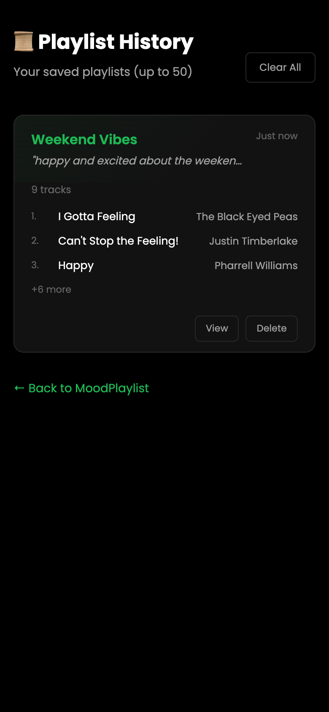

<!--
  Marp template — "terminal-dark"
  Copy this file into your repo (e.g. slides/intro.md) and replace the content.
  Render:  marp slides/intro.md -o slides.html      (or .pdf / .png)
  Theme is self-contained in the <style> block below — no external CSS needed.
-->
---
marp: true
paginate: true
size: 16:9
---

<style>
@import url('https://fonts.googleapis.com/css2?family=JetBrains+Mono:wght@400;500;700&family=Inter:wght@400;600;800&display=swap');
:root {
  --bg:#0d1117; --ink:#e6edf3; --muted:#8b949e;
  --accent:#1DB954; --accent2:#58a6ff; --line:#30363d; --code:#161b22;
}
section {
  background:var(--bg); color:var(--ink);
  font-family:'Inter','Noto Sans','Pyidaungsu',sans-serif;
  font-size:27px; line-height:1.5; padding:56px 72px;
}
h1,h2,h3 { font-family:'JetBrains Mono',monospace; }
h1 { color:var(--accent); font-weight:700; border-bottom:3px solid var(--line); padding-bottom:.2em; }
h2 { color:var(--accent2); font-weight:500; }
h3 { color:var(--ink); }
strong { color:var(--accent); }
a { color:var(--accent2); text-decoration:none; }
code { background:var(--code); color:var(--accent); padding:.06em .35em; border-radius:5px; font-family:'JetBrains Mono',monospace; }
pre  { background:var(--code); border:1px solid var(--line); border-radius:10px; }
pre code { background:none; color:#e6edf3; }
blockquote { border-left:4px solid var(--accent); background:#11161d; color:var(--muted); padding:.5em 1em; }
table th { background:#161b22; color:var(--accent2); }
table td, table th { border-color:var(--line); }
header,footer,section::after { color:var(--muted); font-size:.5em; }
section.cover {
  background:radial-gradient(900px 400px at 80% 12%, rgba(29,185,84,.18), transparent 60%), var(--bg);
}
section.cover h1 { border-bottom:none; font-size:2.3em; }
section.cover .tags code { background:#11161d; color:var(--accent2); margin-right:.4em; }
section.lead { background:#11161d; }
section.lead h1 { border-bottom:none; }
</style>

<!-- _class: cover -->

# MoodPlaylist

## Describe your mood — get a real playlist with album art & YouTube links

**Shyun Lei** · @shirleyshyun-lgtm

<span class="tags">`#built-with-claude` `#groq-api` `#vercel` `#supabase`</span>

---

# What it is

- **Problem:** Finding the right music for your mood is tedious — endless scrolling, skipping songs, generic playlists
- **Solution:** Type how you feel in plain English → get 8-10 real songs with album art
- **One thing it does well:** Turns any emotion into a curated playlist in seconds

---

# How it works

```bash
npm install
npm start
# open http://localhost:3000
```

Stack: **Node.js + Express + Groq API (Llama 3.3)** · built with Claude Code


---

<!-- _class: lead -->

# Features

| Feature | Tech |
|---------|------|
| AI Playlist Generation | Groq API (Llama 3.3 70B) |
| Real Album Art | iTunes Search API |
| YouTube Links | Direct search per track |
| Playlist History | localStorage (50 playlists) |
| Admin Dashboard | Supabase + anonymous stats |
| Security | Rate limiting, input validation |

---

# Screenshots

| Home (with playlist) | History | Admin Dashboard |
|---------------------|---------|-----------------|
|  |  |  |


---

# Links

- **Live:** https://moodplaylist.vercel.app
- **Repo:** github.com/shirleyshyun-lgtm/MoodPlaylist
- **Admin:** /admin.html (password-protected)
- **License:** MIT
